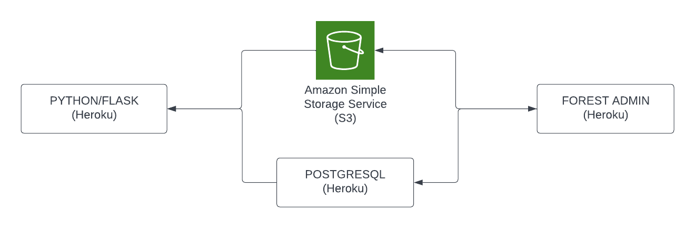

# PORTFOLIO DOCUMENTATION

### link to published portfolio website
[My portfolio website](https://marion-akinyi-portfolio.herokuapp.com/)
### link to my GitHub repo
[Github](https://github.com/marie-debug/Portfolio)
### Youtube presentation
[Youtube presentation](https://youtu.be/R3auCpCDqk4)
## Purpose & target audience
The purpose of this website is  to provide an online portfolio that provides information about me, my skills, interests, professional knowledge and a showcase of my work. To potential employers in the IT field.
## Functionality / features
1. Flask & python: Used to render html pages and handle routing.
2. Css & html: Used css to style and make website responsive. 
3. Javascript: Used js for the navbar. 
4. Postgresql: used  postgresql to store site content.
5. Forest admin: Used to edit content. 
6. S3 bucket: Used to store images.

## Sitemap

## Tech stack 

### website 
1. Flask 
2. Python
3. Javascript
4. Html
5. Css

### Website content management system
1. Forest admin
2. Node js

### Website storage
1. Postgresql
2. AWS S3 Bucket

### Architecture diagram

## Screenshots

